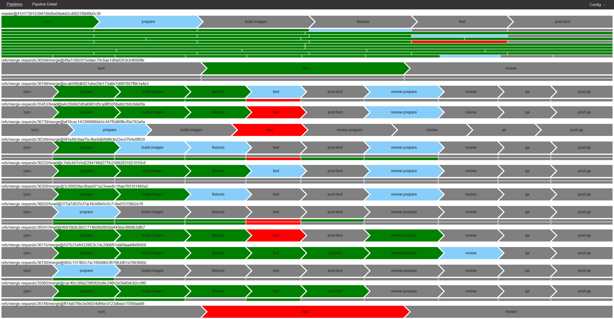
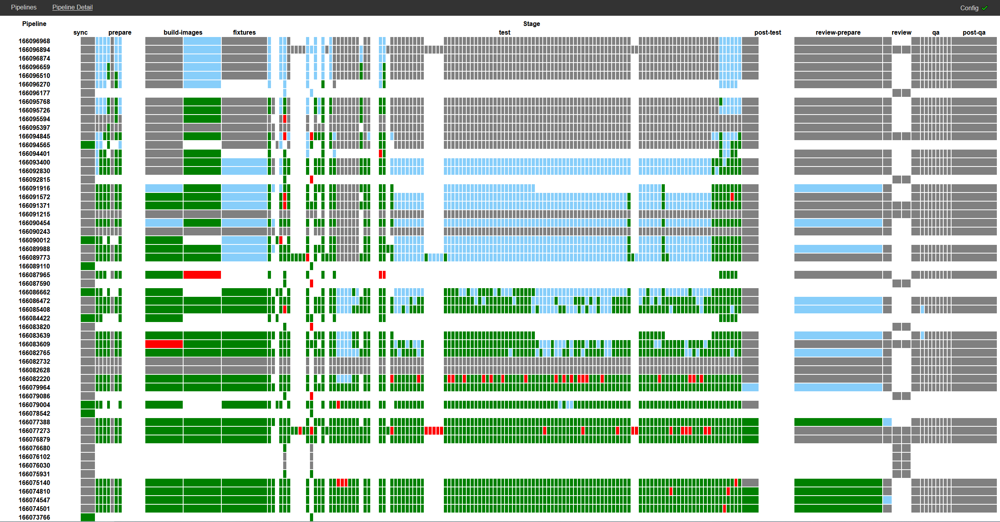

# huge-feedback

This is a dashboard for gitlab ci. It looks something like this:



or like this: 



These are both taken from the [gitlab](https://gitlab.com/gitlab-org/gitlab)
project which has a reasonably complex CI setup, as you can tell.
The dashboard is currently quite focused on monorepos - it only supports
a single configured project at the moment.

Essentially everything happens in the frontend of this application.
The backend only really serves as a cors proxy, and will hide the api token.

### Deployment

There's a couple of options for deploying and running this. There's a plain old uberjar,
which you can just run with e.g. `java -jar huge-feedback-0.1.0-standalone.jar config.edn`.

That's also been packed into a docker container. Again, you should pass the path to the 
configuration file: `docker run lfn3/huge-feedback:0.1.0 config.edn`.

Finally there's a helm chart which you can either get from the releases page, or from my 
repo: `helm repo add lfn3 https://lfn3.net/helm-charts` 
and then install: `helm install lfn3/huge-feedback`.


### Configuration

There's both client side and server side configuration.
The server side config is passed down to the client when the client starts, but can be modified by
on the client.

If you're passing a `config.edn` file directly, it should look something like this:
```edn
{:huge-feedback.apis.gitlab/config     {:huge-feedback.apis.gitlab/base-url   "https://gitlab.com/api/v4"
                                        :huge-feedback.apis.gitlab/project-id 278964
                                        :huge-feedback.apis.gitlab/token      "REDACTED"}
:huge-feedback.config/use-cors-proxy? true
:huge-feedback.config/num-pipelines-to-show 40
:huge-feedback.config/server-port 3030}
```

If you're using helm, the `values` specific to the service are at the bottom of the 
[values.yaml](https://github.com/lfn3/huge-feedback/blob/master/helm-chart/values.yaml#L81)
file, under the `config` key.

### Development
I'd recommend providing a `config.edn` file as described on the classpath - I put mine in
`src/dev/clj/huge_feedback/config.edn`, and if you do the same it'll get picked up automatically
when you invoke `start` in the `huge-feedback.dev` namespace.
So I'd recommend you start a repl (`lein repl` or similar), and do that!
That will start figwheel for hot reloading, and if you alter and reload the serverside namespaces
the webserver will automatically restart.

You can then attach a second nrepl to `7888` (the figwheel port) which will 
allow you to get into the js process by calling `(figwheel.main.api/cljs-repl fig-build-id)`,
again from `huge-feedback.dev`. It should start automatically polling the gitlab api with 
the provided configuration.